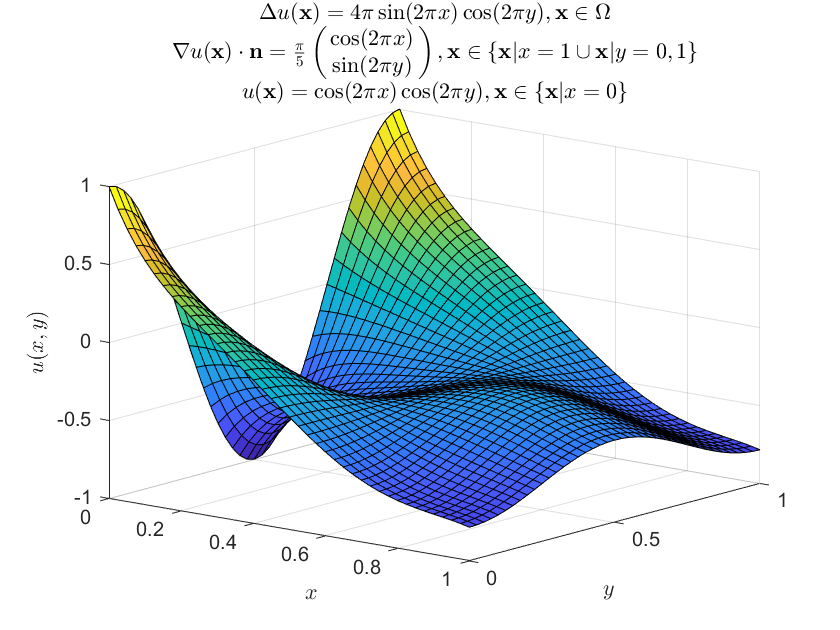

# FEM

Finite Element Implementation of the following problems:
- Poisson equation.
- Heat Equation.
- *(more to come?)*

## Dependencies
- [Eigen](http://eigen.tuxfamily.org/index.php?title=Main_Page)

## Referencies
- The Finite Element Method: Linear Static and Dynamic Finite Element Analysis, by Hughes
- Numerical Solutions of Partial Differential Equations by the Finite Element Method, by Johnson
- [FEM Simulation of 3D Deformable Solids: A practitioner’s guide to theory, discretization and model reduction.](http://barbic.usc.edu/femdefo/sifakis-courseNotes-TheoryAndDiscretization.pdf), by Sifakis 

## Examples
Plots are done with MATLAB.
#### Poisson equation:

#### Heat equation:
